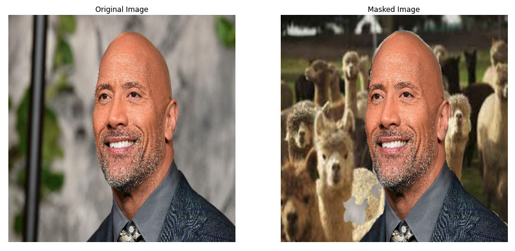

# Virtual Background

|  | 
|:--:| 
| The Rock |>

In online meetings, people frequently avoid to show their backgrounds due to privacy. The virtual background is widely used in many applications such as Zoom conference.

# Project Goals

1. Read a research paper and apply to a **real-world project**
2. Implement [BiSeNet](https://arxiv.org/abs/1808.00897) with PyTorch **from sratch**
3. Implement **end-to-end project pipeline** from scratch with minimum references
4. **Live webcam demo** using OpenCV
5. **Effective project management** using various Git features including issues, pull requests, and version control

# Dataset

- [Kaggle - AISegment](https://www.kaggle.com/datasets/laurentmih/aisegmentcom-matting-human-datasets)
- Download dataset using Kaggle API: `kaggle datasets download -d laurentmih/aisegmentcom-matting-human-datasets`
- `34,427` images(RGB) and corresponding matting(RGBA) results
- Most images are upper-body person images which are suitable for virtual background task.

# Model - BiSeNet

|  | 
|:--:| 
| *[BiSeNet](https://arxiv.org/abs/1808.00897)* |>

The semantic segmentation model selected for this project is [BiSeNet](https://arxiv.org/abs/1808.00897). I was looking for a **real-time** semantic segmentation model with fast speed and decent performance. I assumed that segmentation task for virtual background consisting of two classes (person and background) is a easier task than the cityscapes dataset which the model was tested on. **BiSeNet** achieved `74.7% mIoU` on the **CityScapes test** dataset with `65.5 FPS` and `15.2 ms`. I referenced [paperswithcode](https://paperswithcode.com/sota/real-time-semantic-segmentation-on-cityscapes) and [awesome-semantic-segmentation](https://github.com/mrgloom/awesome-semantic-segmentation) to search models.

BiSeNet effectively secures **sizeable receptive field** and **rich spatial information** using the Spatial Path and Context Path. If you want to look at the **detailed explanation of the paper and the implementation**, check out my **blog** and **deep-learning-papers repo** [BiSeNet Guide & Implementation](https://noisrucer.github.io/paper/bisenet/) or [BiSeNet Repo](https://github.com/noisrucer/deep-learning-papers/tree/master/BiSeNet)

# Results

* Final Epoch: `9`

**Training set**

|Metric|Value|
|:---|:---|
|Loss|0.0887432|
|Accuracy|0.962712|
|mIoU|0.926885|
|Background IoU|0.91744|
|Person IoU|0.93633|

**Validation set**

|Metric|Value|
|:---|:---|
|Loss|0.0899316|
|Accuracy|0.962299|
|mIoU|0.927337|
|Background IoU|0.927285|
|Person IoU|0.927389|

# Training

1. Clone the repo

```bash
git clone https://github.com/noisrucer/virtual-background.git
```

2. Inside the directory, create `data/` and `model_weights/` folders.

3. Download the dataset() and unzip in `data/` folder.

```bash
kaggle datasets download -d laurentmih/aisegmentcom-matting-human-datasets
```

4. Execute `generate_csv.py` in the project directory. Then, `dataset.csv` will be created in `data/`

```bash
python generate_csv.py
```

5. Change the data directories accordingly in `config.json` "model" args. Also, try out different hyperparameters by yourself

6. Train the model

```bash
python train.py -c config.json
```

7. Log files and model checkpoints will be saved in `saved/` folder

# Inference

Download the model weight [checkpoint-epoch9.pth](https://drive.google.com/file/d/1X4uSjg9VZLJ4SYaX7GHI3VlL1i9UOEVo/view?usp=sharing) and move to `model_weights` directory.

* Single image - You can try the model for a single image in `virtual_background_test.ipynb`.

* Webcam demo - Execute `webcam_demo.py` for real-time webcam demo. Make sure you run on **local** environment unless you set up camera devices in the Linux server.

# Conclusion

In this project, my main goal was to implement the whole project pipeline from scratch and "make it **work**". Sophisticated libraries such as **mmsegmentation** provide efficient and easy pipeline with good performance. On the other hand, implementing from scratch often yields many logic errors that are hard to debug. Moreoever, even one error might cause the whole project to fail. 

Experimenting with many loss functions, hyperparmeters, etc, the model worked quite well!

It was a simple project but I learned a lot during the project. It showed great result on validation set and real-world datasets. In the next project, I'll do more cool and challenging stuff!

